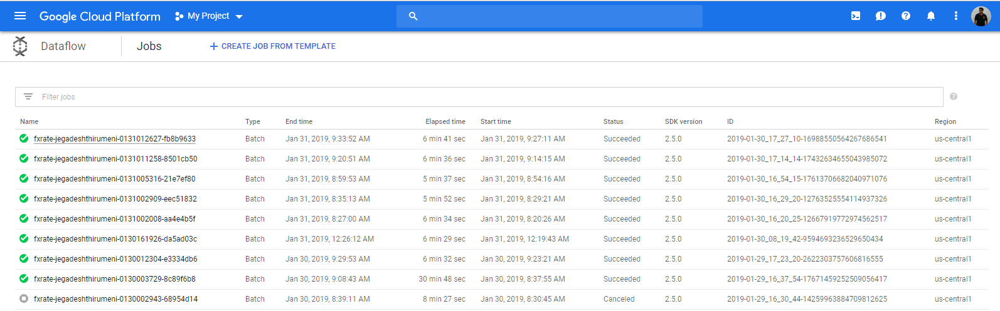

# Aliz Tech Challenge 4 : FXRate-Pipeline

## Problem Statement :

TODO : ADD THE Problem statement

## Solution :

Developed a Beam Pipelin using Java to read from the file in google cloud storage, calculate the moving average through various PTransforms and save the output in Google Bigquery.

#### Assumptions :

* Maven & Java 1.8 is installed in the machine

#### To run the Program :

1. Create a Google cloud platform project & enable billing
2. Enable the Cloud Dataflow, Compute Engine, Stackdriver Logging, Google Cloud Storage, BigQuery.
3. Create a Service Account Key for the project and download the Json in local
4. Create a cloud storage bucket and create two folders i.e temp & stage that will be used during the pipeline execution.
5. clone this project in local and run `mvn clean install` inside the project folder which will create a shaded jar with all the necessary dependencies inside targe folder.
6. Run the below shell script to execute the pipeline


##### Shell Command to execute the Pipeline :
```shell
export GOOGLE_APPLICATION_CREDENTIALS=<path to google cloud service account key>
java -jar ./target/fxrate-pipeline-bundled-1.0.0.jar \
--runner=DataflowRunner \
--project=<project-id> \
--tempLocation=<Google storage temp location> \
--stagingLocation=<Google storage staging location> \
--bigQueryDataset=<Bigquery Output Dataset Name> \
--bigQueryTable=<Bigquery Output Table Name> \
--inputFile=<input file path>
```
##### Sample Shell Command to execute the Pipeline :

```shell
export GOOGLE_APPLICATION_CREDENTIALS="/Users/jegadeshthirumeni/Downloads/credentials.json"
java -jar /Users/jegadeshthirumeni/eclipse-workspace/fxrate-pipeline/target/fxrate-pipeline-bundled-1.0.0.jar \
--runner=DataflowRunner \
--project=jeganhadoopcluster \
--tempLocation=gs://aliz-tech-challenge/temp \
--stagingLocation=gs://aliz-tech-challenge/staging \
--bigQueryDataset=aliz \
--bigQueryTable=fxrateAverage \
--inputFile=gs://solutions-public-assets/time-series-master/GBPUSD_2014_01.csv
```

### Job Monitoring :

Goto to Google job monitoring link https://console.cloud.google.com/dataflow?project=project-id to check the status of the job. The application monitoring link are available in the above script logs as well.



#### Sample Job Monitoring  UI:

TODO : ADD THE IMAGE OF ANY OF THE JOB
  
  #### Output :
  
  TODO : Include the sample input & output details

